# TODO:

*In order of priority*

#### *@Benita: Ignore all of this todo stuff (everything before the three horizontal lines)*

### Finish off create new website section guide:

   - [x] Prep up illustrator for python code
   
   - [x] Running python code (this will have to change as it merges into js)
   
   - [x] Setting up google spreadsheet
   
   - [x] Entering details into google spreadsheet
   
   - [ ] Final formatting

### Organise the timeline data for Benita

   - [ ] Look at the format for the time stuff and try and figure out what's actually being communicated
   
   - [ ] Organise it up for Benita (similar level of stuff to what I got from Matthew)

### Read through this thing and tidy it up

   - [ ] Make sure that there's a logical flow, especially to someone who has no idea what they're doing and hasn't read this before.

   - [ ] Write up [github guide](#githubGuide)

   - [ ] This will likely include a better 'contents' page.

### Website improvements?? Look into:

   - [ ] Turning python code into js (prob just gonna have to ask Ben for a lotta help on this one)

   - [ ] Better gui for entering of data into spreadsheet

   - [ ] Reading in names from illustrator's svg files directly into spreadsheet

   - [ ] Automatic entering of data into spreadsheet?? The PDF from buildcorp looks a lot like an excel spreadsheet that's been 'printed'

### Other:

   - [ ] Do a writeup on this thing (look at trello comment for breif details)

   - [ ] Make "temporary" layer that includes temp states of westwingnorth, balcony, & southwing

## Unrelated stuff

   - [ ] Finish workflow writeups
   
   - [ ] Talk to Craig about workflows
   
   - [ ] Ghost plugin Fab thing

*****

*****

*****

# Office Staging Visualisations

## Intro

GithubRepoLink

## Getting all the files ready

If you have no experience with github and downloading repos, this section will guide you through setting everything up so that you can begin to edit the website. There are 2 main ways that you can do this:

### Download Zip

This method provides no backups or web hosting capabilities, but is a bit less involved and takes a lot less time.

1. On the top of this page, click on **BVN_Office_Staging** to get to the main page of the repository. 

2. Then, click on **Clone or download**, selecting **Download ZIP**.

3. Place and extract the folder wherever you need it. You now have all the files! [Here is a guide on the different important files](#fileGuide).

### Github Repo Pulling

This method is recommended for most people - even though it takes a bit longer to get started, the payoffs of easy version control and web hosting are worth it.

1. [Create a github account](https://github.com/join?source=other) if you don't have one already.

2. [Download and install the github for desktop application](https://desktop.github.com/).

3. Go to [this repo's webpage](https://github.com/BaptisteHiggs/BVN_Office_Staging), and click on *Fork*.

4. It may ask you to verify your email address - do it if it asks you of course! If it did, redo step 3 after verifying.

*Note: BVN's spam filter may think that this email is spam if you used your work email address. Try waiting a bit and checking your junk folder just in case! If you can't seem to find it, you can always use a different address.*

5. Open up github for desktop and log in.

6. Select **File > Clone Repository...**

7. Select the repo called [your name]/BVN_Office_Staging, then choose where you'd like the repo to be downloaded to in the *Local path* textbox. Once you've decided, click clone to download the repo!

*Note: It's difficult (but possible) to change where a repo lives, so choose carefully! Copy pasting the repo once it's been downloaded won't update the where github for desktop thinks it lives.*

8. All of the files have now been downloaded. [Here is a guide on the different important files](#fileGuide). If you'd like to use some of github's backing up or web hosting features, [here's a very quick guide to what the basic uses are](#githubGuide).

## Standard Workflow

This will go through the standard editing workflow for a previously set up website. There are three main parts to editing the data on the website:

 - Editing the times

 - Editing the visuals

 - Collating the data

[See here](#SetUp) for a guide on how to set up a new website.

### Editing the times

The times are entered and stored on a google sheets doc, which can be [viewed here](https://docs.google.com/spreadsheets/d/1Np-BOM5_Jr6B4Obx_9ls0JlX0vd-i1pDeVKMYbUYA_s/edit?usp=sharing). If you'd like to have editing priveleges, please email me at BaptisteHiggs@gmail.com

Inside the google doc, the columns represent the different states of the different areas. [See here for a guide on how the naming convention works](#namingConvention) - if you have the time (and you're confident you can do it without messing it all up), please feel free to change it.

The rows represent each of the days, spanning between August 2017 and January 2018. Each of the cells, a combination of the day and the states of each of the areas, are either a 1 or a zero (or somewhere in between) to represent how transparent that state should be on that day.

### Editing the visuals

The way that the website works is that there are three base images that can be manipulated:

 - *ExistingFloorplan.png*,
 
 - *EmptyFloorplan.png*,
 
 - & *ProposedFloorplan.png*

And one illustrator file that can be used to edit the different zonings (orange areas and where the floorplans are split up):

 - *MasterFloorplan.ai*

If you'd like to edit one of the base images, just open it up in photoshop, and as long as the size of the image remains the same your edits should work like you'd expect them to.

If you'd like to edit the zonings inside the illustrator file for the website, open up the illustrator file and edit the zones or clipping planes as you'd like. When you want to save your changes, make sure that the **Zones**, **clippaths**, & **Background** layers are visible. After that, you'll need to **File > Save As** the image as an SVG file. Make sure the settings are the same as these:

And then save!

To actually push these changes to the website, you'll need to [collate the data](#collateData)

### <a name="collateData">Collating the data</a>

1. To start collating the data, open up the *Prepare_SVG.py* file.

   *Note: You'll need python 2.7 installed in order to do this!*
   
2. You have two options here. Either allow it to use the default options that are presented, or enter other values. Either way, follow the prompts as they lead you through the process.

   *Note: If you choose to enter new values, you'll have the option to save them as the new default values after entering them.*

3. The program is done! Index.html should work with your newly updated files.

## Other Issues

### <a name="namingConvention">The naming convention.</a>

The naming convention of the states may not be intuitive, but there is logic to it (feel free to change it if you'd like to and feel that you'd be able to without messing anything up - every place that the convention is used will need to be updated!). 

It works like a coordinate system, with the first number representing the **x** value, and the second the **y** value. The A represents how it's first in that block - there used to be Bs and Cs but now there are only As.

The three terms - EXS, CON, & PRP - are short for existing, construction, and proposed floorplans. The construction phase is when there's an orange shape on top of it, and the existing and proposed floorplans are the different floorplans that are respectively before and after the works are completed in each area. 

### <a name="fileGuide">Important Files</a>

There are various files in the repo, some more critical than others to the website's creation. Here's a list of the ones you may need to know about:

| Name | Description |
|---|---|
|index.html|This is a ***h**yper<b>t</b>ext **m**arkup **l**anguage* file, and is what people are viewing when looking at the visualisation. If you need to edit it and you're a bit unsure of how to do what you want to do, [this website](https://www.w3schools.com/html/default.asp) is a great guide on how html works.|
|style.css|This is a ***c**ascading **s**tyle **s**heets* file, and it controls a lot of how the website looks, rather than the content - think fonts, colour, spacing, arrangement and other rules for the html. This is needed for the html to load correctly.|
|scripts.js|This is a ***j**ava<b>s</b>cript* file. It controls how the visualisation actually works behind the scenes, connecting the spreadsheet data, the slider, and the different images in a way that makes sense. This is needed for the interactivity of the visualisation.|
|MasterFloorplan.ai|This is the illustrator file, and is the first file not needed for the actual website to load. This file is used for all the clipping mask and other layer editing tasks.|
|EmptyFloorplan.png|This image is used as the background of the visualised floorplan.|
|ExistingFloorplan.png|This is the image used for how the office was layed out beforehand.|
|ProposedFloorplan.png|Same as *ExistingFloorplan.png* except for the future layout.|
|MasterFloorplan.svg|This is a ***s**calable **v**ector **g**raphics* file, and is the file you should overwrite when saving for the website. It provides the clipping masks and the block layers.|
|Prepare_SVG.py|This is a ***py**thon* file that takes all the relevant information out of *MasterFloorplan.svg* file and puts it into the *index.html* file. You'll need to install [python 2.7]() in order to use it.|
|README.md|That's this document! Provides a comprehensive guide on how to edit and otherwise use the website for visualisations, and looks a lot better when viewed on github.com or in github for desktop. All the images used in this document are stored in the [doc_images](doc_images) folder.|

### <a name="githubGuide">Important Files</a>

Gotta do this!

 - Backing stuff up
 
 - Web hosting pages stuff

## <a name="SetUp">New Website Setup</a>

Creating a new website for a different floorplan entirely is quite an involved process, especially depending on what source information you have. This guide will assume that you have a timeline of different stages, an image of the floorplan before, an image of the floorplan afterwards, and a copy of the files in this repo.

*Note: This method isn't limited to just 2 states (in fact, it usually uses 3). You can use as many different states as you want (e.g. beginning, stage 1, stage 2, stage 3, etc., end, ...)*

### Base image creation

To start off, we'll need to create the base background image and the different states to go with it. These are all basically just floorplans, one with everything that doesn't change, and the others all the bits that do change.

1. Inspect all of your stage images (typically just before and after), noting which parts of the images are common between the states. For example, in the following two floorplans (existing and proposed):

   The following is common to both:

2. Using a copy of one of the original images, photoshop out the part that isn't common to get the background image:

3. Then, photoshop this common section out of the original two images (to be left with only the uncommon parts):

   *Note: Ensure that these are saved as png files with transparent backgrounds for the best results.*

4. You should now have all of your base images.

### Illustrator Setup

A lot of the workflow is creating an illustrator document set up correctly. This is the basic beginning to that file.

1. Open up an illustrator document with appropriate sizing (should fit your images well - this file is the one that's going to be used for creating the SVG files).

2. Import the images using **File > Place**. Their names should be "\<Linked File\>" in the layers panel - do not embed them. As the files should be mostly transparent with only black lines detailing the floorplan on them, the order they're placed doesn't matter. However, it's good practice to have the base empty floorplan on the bottom with the others on top.

   *Note: Although not necessary, it's a good idea to put them all in a layer called "Source Images" or something similar."*

3. Ensure that they're all placed exactly in the right position relative to each other (right on top of each other):

### Defining Sections

This section is largely dependant on what type of information you're sourcing from. In some way, you'll need to split the existing and proposed floorplans into groups of elements that all appear and disappear at the same time. The information that I had while building the original BVN floorplan website was a collection of 22 pdf renders of different stages of the building's works, each having some variation of different groups of elements:

The following steps will assume you have similar information:

1. Select all of the pdf files in file explorer, right clicking and selecting "Combine files in Acrobat..."

   *Note: This is just to make viewing easier while scrolling through the files quickly.*

2. At the same time, open up one of these files in photoshop/paint/etc. (I like to use snipping tool) - any image editor that can draw lines. You could also print out a copy and draw by hand if you'd find that easier!

3. Scroll through the set of images in acrobat, and draw a line between anything that changes and what didn't change every time part of the image changes. For example, in the following two images:

   A line would be drawn here:

   The end result after looking through all the files should look something like this:

4. This will give you a vague idea of where the different groupings of elements are. Now, we'll have to go through the list of images again and look out specifically for each block to see where its exact barriers are. This becomes difficult as the barriers of the existing elements don't line up with the barriers of the proposed elements. You'll need to look out for both existing and proposed states of each section. For example, in these two paths of the same section:

   The proposed and the existing paths are necessarily different while still covering a similar area.
   

5. After understanding where the barriers are and how the existing and proposed groupings differ, draw polylines around each group in the illustrator document from before (in a new 'paths' layer, ideally with sub-layers for existing and proposed).

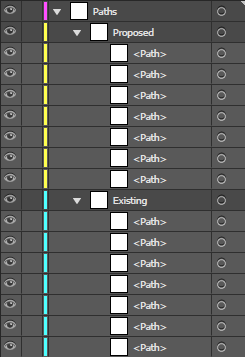

### Creating clipped images

The paths now need to be applied to the images as clipping masks to seperate the different sections of the image.

1. Depending on how many different clipping paths you have per state, create that many copies of each image (except the background image as it won't be clipped). Use **Ctrl + Shift + V** to paste in the same place as the original.

2. Ensure that the paths are above the source images:

3. To create a clipping mask, first select the source image, then select the appropriate path. Then select **Object > Clipping Mask > Make**, or press **Ctrl + 7** for a shortcut. This will delete both of the original objects, a \<Clip Group\> object appearing in their place.

4. After having repeated this process for all of the path + file combinations, all of your clip groups should be finished. Rename the clip groups appropriately. A good way to name them includes:

     - <a name="layerName">The location (e.g. northwing, southprojectroom, etc.)</a>
     
     - The state (e.g. existing or proposed)
     
     - No spaces or symbols, even dashes and underscores (All of these are substituted for obscure character combinations when exporting to SVG)
     
     - No upper case letters.
     
     - No numbers at the beginning of the name (same issue as above) although later in the name is fine.

   e.g. "northwingexisting", "northwingproposed", "southprojectroomexisting", etc.

5. Move all of the "\<Clip Group\>" files into their own file base layer, called something like *clippaths*. The clipping paths are now done! You should end up with something like this (except with your own names of course!):

### Creating overlay blocks

If you need any overlayed blocks over the source images, like construction zones, this method details how to create them.

1. With the pen tool in illustrator, create all your blocks in their appropriate positions (inside an appropriately named layer, [see here for guidelines](#layerName)).

2. In order to make them translucent, select them all and change the opacity down to an appropriate value (I set it to around 50%).

3. Note down which blocks all appear together and disappear together, and then group them in illustrator (Right click and select *group* or press **Ctrl + G**). For example, I grouped these together:

---------

   Now there should be a mix of grouped and non-grouped blocks (if there are only groups, you can skip steps 4-7). Unfortunately, this doesn't work well with the current method of interpreting the svg in the javascript, so we'll need to group each of the individual blocks with a workaround invisible block.

4. With the pen tool, create another small block that's out of the way.

5. Select the block, and make sure that both the border's and the fill's colours are set to 'None'.

6. Duplicate the block as many times as necessary (one for each actual block not in a group). Use **Ctrl + Shift + V** to paste in the same location.

   *Note: I renamed the blank blocks to BlankBlock from \<path\> for clarity.*
   

7. Group each of the blocks not in groups with one of the blank blocks.

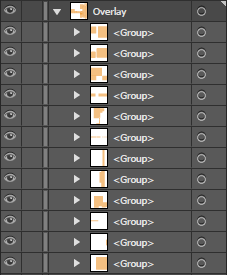

8. Finally, these need to be renamed appropriately. [See here](#layerName) for effective naming guidelines. You should end up with something like this:

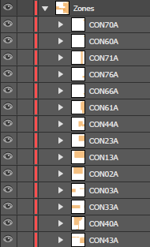

   *Note: My naming in this example is quite terrible really, try and do better than me! The numbers don't make for particularly recognisable locations.*

### Prepping the illustrator file for merging

The illustrator file is now effectively finished! We just now need to make sure that it's exported correctly to the svg format so that the website can use it.

1. Open up the file and ensure that you've saved it.

2. Take note of the layers, ensuring that:

      - Any extra layers that you've made that aren't supposed to be in the website are hidden
      
      - Any layers that are supposed to be in the website are visible
      
      - All the names of layers and their items follow [these rules](#layerName)
      
      - Every item is inside only the one base layer (e.g. **clippaths > PRP40a** is correct whereas **clippaths > proposed > PRP40A** won't work)
      
      - All of the overlay blocks are in groups

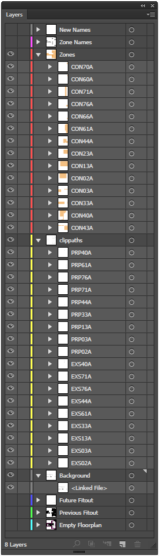

3. Once you're sure everything is correct, go **File > Save As...** and save the file as an **svg** in the same folder.

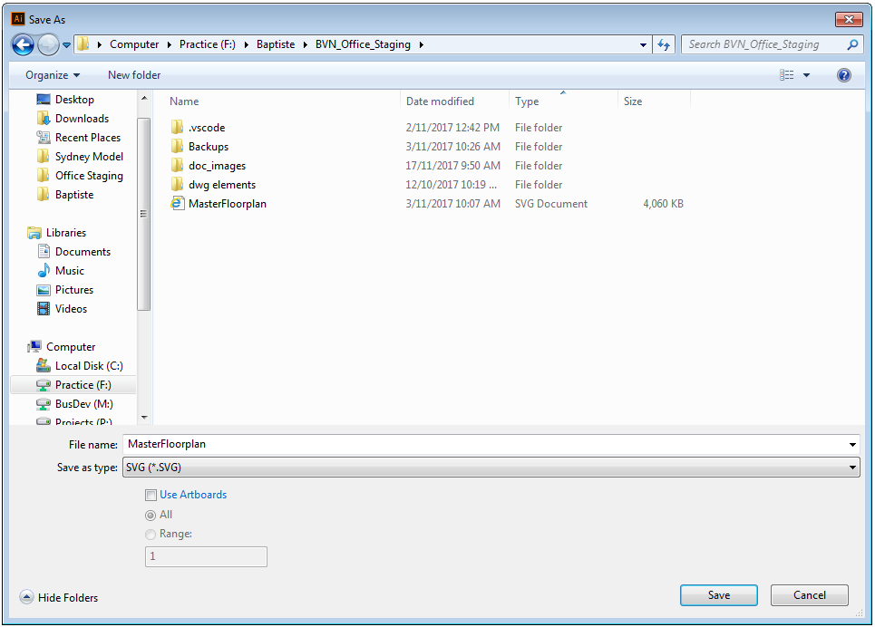

4. When the options appear, ensure that the imge location is linked and that the SVG Profile is set to SVG 1.1.

### Setting up the spreadsheet

To have the website know what times the different areas are in their different states, a google spreadsheet is used.

1. A google sheet is used for the time data; [here's the original website's google sheet](https://docs.google.com/spreadsheets/d/1Np-BOM5_Jr6B4Obx_9ls0JlX0vd-i1pDeVKMYbUYA_s/edit?usp=sharing), your new one will look very similar. First off, [create a new sheet here](https://docs.google.com/spreadsheets/u/0/).

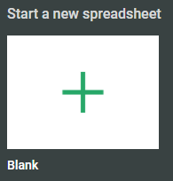

2. In **A1**, enter *date*. In **B1**, enter *notes*. These are the keywords that the script will look for.

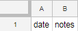

3. The rest of the first row will contain all of the location/state combo names. These names will have to be written in exactly the same way that they appear in illustrator - case matters! Although it doesn't matter which way you order these columns, grouping the columns by location (keeping for example bridge_existing, bridge_construction, & bridge_proposed together, then having reception_existing, reception_construction, reception_proposed together, etc.) makes the editing of the data a lot easier to manage.

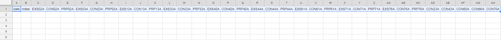

4. The first column will contain every date that is relevant to the construction in chronological order. To create dates, simply type in the first date, select the cell, and then drag it down. It will autocomplete every date until you stop dragging.

   *Note: Your google account (like mine), may be set to American date formatting. You'll need to write your dates in their format (mm/dd/yyyy) for the autofilling to work correctly. The javascript later on may not even work with other date formatting methods as I've only used it with American date formatting.*
   
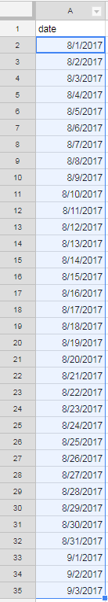

### Entering the times

Now that the spreadsheet has been set up, the actual times need to be entered into the spreadsheet's grid.

1. Due to the large variance in the possible source data you could have for this step, you'll mostly have to figure it out on your own. Somehow, you'll need to find out when each stage of construction occurs for each location. For example, you may know that the bathrooms will be in the previous state from the 11th of October until the 5th of November, they'll be under construction from then until the 1st of December, and that from then on they'll be in the proposed state.

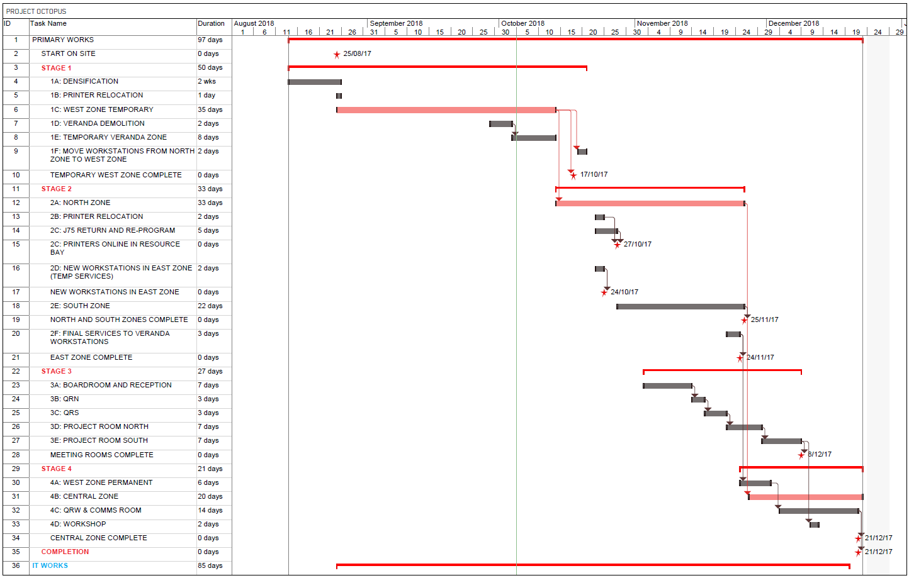

2. The way that the spreadsheet works is each cell takes a value between 1 and 0 (or equal to either one or zero, this is usually the case), using that number as the opacity of that item (where 0 is invisible and 1 is opaque). Enter each of these values into the spreadsheet appropriately, given the above data.

   *Note: Google sheets makes it really easy to duplicate values over a large number of cells. Just make one 0 or 1, select the cell, and then drag it down/up/right/left to duplicate it in that direction (same way as how we duplicated the dates!). Please don't enter each 1 and 0 manually!!

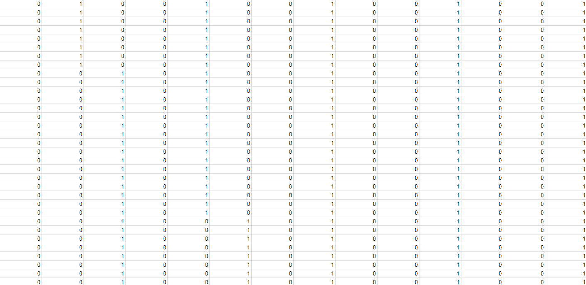

3. To make these values a lot easier to visualise while working with the spreadsheet we'll change the colour of the cell depending on its value. Select all the cells that have these values (0>=value>=1) in them, then selecting **Format > Conditional Formatting...**

4. Select the **Color scale** tab, choosing the gradient you'd like to use. Click **Done** when you're finished.

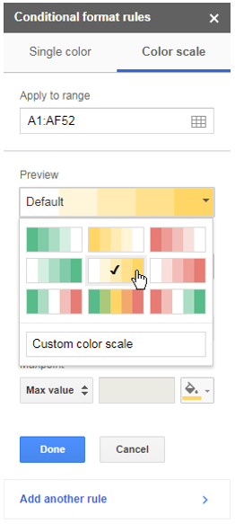

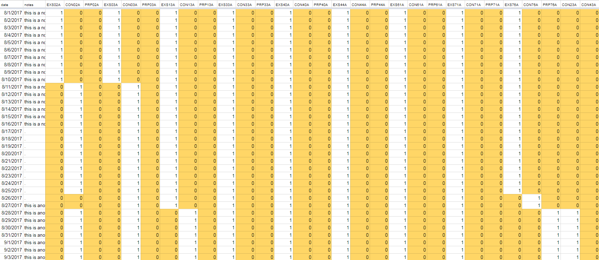

### Linking the spreadsheet to the html file

In order for the the data to work right, the google sheet needs to be linked.

1. Open up your google sheet, and grab the URL. It should look something like this:

   ht&#8203;tps://docs.google.c&#8203;om/spreadsheets/d/1Np-BOM5_Jr6B4Obx_9ls0JlX0vd-i1pDeVKMYbUYA_s/edit#gid=0
   
2. What's needed is the key - that's the long string of characters after **d/** and before **/edit**:

   ht&#8203;tps://docs.google.c&#8203;om/spreadsheets/d/**1Np-BOM5_Jr6B4Obx_9ls0JlX0vd-i1pDeVKMYbUYA_s**/edit#gid=0

3. Open up your html file (most likely index.html) and find the line that starts with **window.BVNofficeProgressPublicSpreadsheetUrlKey**

4. Copy the key from your spreadsheet and paste it in the spot where the other key was in the html file.

   *Note: the apostrophes aren't part of the old key and should be left on either side of the new key.*

### Collating the data

The data now needs to be collected and put together in the right place for the website to work!

1. To start collating the data, open up the *Prepare_SVG.py* file.

   *Note: You'll need python 2.7 installed in order to do this!*
   
2. You have two options here. Either allow it to use the default options that are presented, or enter other values - you'll likely need to enter new values the first time running this script unless you've used the exact same naming scheme! Either way, follow the prompts as they lead you through the process.

   *Note: If you choose to enter new values, you'll have the option to save them as the new default values after entering them.*

3. The program is done! Index.html should work with your newly updated files.

### Final formatting

# DO THIS!

Now that the website is nearly finished, the html and css files need some touch-ups to get the appearance right.

1. Open up the **html** file and find the line that says **\<body class="container">**.

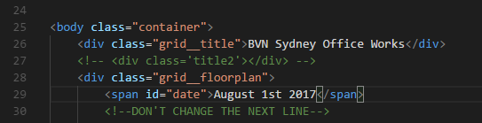

2. Just below it, you should see a line that starts with **\
**. Just after it is the title displayed - change it to whatever you'd like.

3. Just below, there's a line that starts with **\**. Just after it is the default displayed date before the slider is moved, you can change it to a more appropriate date if you'd like.

------

4. Open up the **css** file (most likely called style.css). With this file we'll change the theme colours used.

5. At the very top of the file there should be a line that says "**:root {**"; the listings below this line are the colours used in the document. There are three main different ways to define colours:

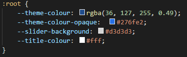

|Name|Example|Description|
|---|---|---|
|RGB|rgb(250,128,114)|An additive mix of **R**ed, **G**reen, & **B**lue with values from 0 to 255 for each.|
|RGBA|rgba(250,128,114,0.4)|The same as RGB with the capability of changing the opacity with the last digit (a value between 0 & 1, inclusive).|
|Hex|#FA8072|Basically just a different format for RGB using hex numbers (16 digits: 0 -> F), two digits for each R, G or B.|
|Name|Salmon|Very simple, just putting in the name of the colour.|
|HSL|hsl(6,93%,71%)|Stands for **H**ue **S**aturation **L**ightness. Don't use this, no one does.|

6. Change each colour to fit. Currently there's no way of changing the gantt chart's colours sadly!

