# TODO:

*In order of priority*

### Create a section on the different options (with pros & cons) for downloading and interacting with this:

   - [ ] Create github account, download github for desktop, fork repo
   
   - [ ] Create github account, install github stuff for command line (why on earth would they do this option), fork repo
   
   - [ ] Download zip folder of repo

### Finish off create new website section guide:

   - [ ] Prep up illustrator for python code
   
   - [ ] Running python code (this will have to change as it merges into js)
   
   - [ ] Setting up google spreadsheet
   
   - [ ] Entering details into google spreadsheet
   
### Read through this thing and tidy it up

   - [ ] Make sure that there's a logical flow, especially to someone who has no idea what they're doing and hasn't read this before.
   
   - [ ] Write up [github guide](#githubGuide)
   
   - [ ] This will likely include a better 'contents' page.

### Website improvements?? Look into:

   - [ ] Turning python code into js (prob just gonna have to ask Ben for a lotta help on this one)
   
   - [ ] Better gui for entering of data into spreadsheet
   
   - [ ] Reading in names from illustrator's svg files directly into spreadsheet
   
   - [ ] Automatic entering of data into spreadsheet?? The PDF from buildcorp looks a lot like an excel spreadsheet that's been 'printed'

*****

*****

*****

# Office Staging Visualisations

## Intro

GithubRepoLink

## Getting all the files ready

If you have no experience with github and downloading repos, this section will guide you through setting everything up so that you can begin to edit the website. There are 2 main ways that you can do this:

### Download Zip

This method provides no backups or web hosting capabilities, but is a bit less involved and takes a lot less time.

1. On the top of this page, click on **BVN_Office_Staging** to get to the main page of the repository. 

2. Then, click on **Clone or download**, selecting **Download ZIP**.

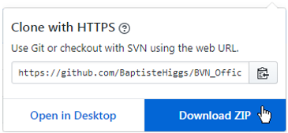

3. Place and extract the folder wherever you need it. You now have all the files! [Here is a guide on the different important files](#fileGuide).

### Github Repo Pulling

This method is recommended for most people - even though it takes a bit longer to get started, the payoffs of easy version control and web hosting are worth it.

1. [Create a github account](https://github.com/join?source=other) if you don't have one already.

2. [Download and install the github for desktop application](https://desktop.github.com/).

3. Go to [this repo's webpage](./), and click on *Fork*.

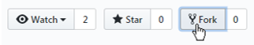

4. It may ask you to verify your email address - do it if it asks you of course! If it did, redo step 3 after verifying.

5. Open up github for desktop and log in.

#### *@Benita: Could let me know if step 5 needs more clarification? I couldn't get an image of it or try it out, just assuming it happens like that.*

6. Select **File > Clone Repository...**

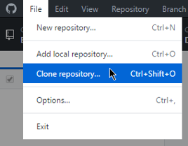

7. Select the repo called [your name]/BVN_Office_Staging, then choose where you'd like the repo to be downloaded to in the *Local path* textbox. Once you've decided, click clone to download the repo!

*Note: It's difficult (but possible) to change where a repo lives, so choose carefully! Copy pasting the repo once it's been downloaded won't update the where github for desktop thinks it lives.*

#### *@Benita: Could you please take a screenshot when completing the above step for me? It should look like this:*

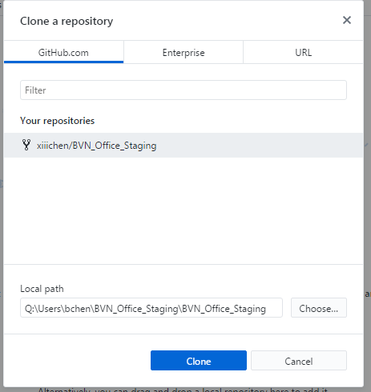

#### *Except with the appropriate repo there. Thanks! :)*

8. All of the files have now been downloaded. [Here is a guide on the different important files](#fileGuide). If you'd like to use some of github's backing up or web hosting features, [here's a very quick guide to what the basic uses are](#githubGuide).

## Standard Workflow

This will go through the standard editing workflow for a previously set up website. There are three main parts to editing the data on the website:

 - Editing the times

 - Editing the visuals

 - Collating the data

[See here](#SetUp) for a guide on how to set up a new website.

### Editing the times

The times are entered and stored on a google sheets doc, which can be [viewed here](https://docs.google.com/spreadsheets/d/1Np-BOM5_Jr6B4Obx_9ls0JlX0vd-i1pDeVKMYbUYA_s/edit?usp=sharing). If you'd like to have editing priveleges, please email me at BaptisteHiggs@gmail.com

Inside the google doc, the columns represent the different states of the different areas. [See here for a guide on how the naming convention works](#namingConvention) - if you have the time (and you're confident you can do it without messing it all up), please feel free to change it.

The rows represent each of the days, spanning between August 2017 and January 2018. Each of the cells, a combination of the day and the states of each of the areas, are either a 1 or a zero (or somewhere in between) to represent how transparent that state should be on that day.

### Editing the visuals

The way that the website works is that there are three base images that are manipulated:

 - *ExistingFloorplan.png*,
 
 - *EmptyFloorplan.png*,
 
 - & *ProposedFloorplan.png*

There are also the orange zones and the clipping planes (i.e. where the above images are split up) included in the *MasterFloorplan.ai* Illustrator file. If you'd like to edit one of the base images, just open it up in photoshop, and as long as the size of the image remains the same your edits should work like you'd expect them to.

If you make any edits to the data inside the illustrator file for the website, firstly make sure that the **Zones**, **clippaths**, & **Background** layers are visible. After that, you'll need to **File > Save As** the image as an SVG file. Make sure the settings are the same as these:

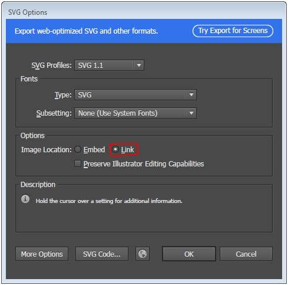

And then save!

To actually push these changes to the website, you'll need to [collate the data](#collateData)

### <a name="collateData">Collating the data</a>

1. To start collating the data, open up the *Prepare_SVG.py* file.

   *Note: You'll need python 2.7 installed in order to do this!
   
2. The script will ask you for the name of the svg file generated. Enter it, ensuring that all the cases of the letters are correct and that you've put *.svg* on the end of it.

3. After this, it should ask for the html file's name. It's likely *index.html* unless you've renamed it. As before, ensure that the cases are correct and *.html* is on the end of it!

4. The program is done! Index.html should work with your newly updated files.

## Other Issues

### <a name="namingConvention">The naming convention.</a>

The naming convention of the states may not be intuitive, but there is logic to it (feel free to change it if you'd like to and feel that you'd be able to without messing anything up - every place that the convention is used will need to be updated!). 

It works like a coordinate system, with the first number representing the **x** value, and the second the **y** value. The A represents how it's first in that block - there used to be Bs and Cs but now there are only As.

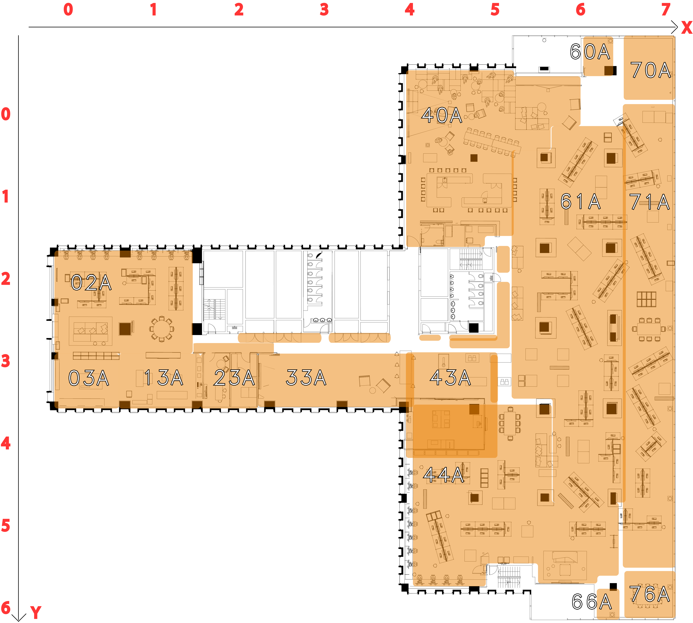

The three terms - EXS, CON, & PRP - are short for existing, construction, and proposed floorplans. The construction phase is when there's an orange shape on top of it, and the existing and proposed floorplans are the different floorplans that are respectively before and after the works are completed in each area. 

### Allowing for more layers to be shown

Currently, the *Prepare_SVG.py* python script that collates all the data ignores anything that's not visible and that's not in any of the following layers:

 - clippaths
 
 - Zones
 
 - Background
 
If you'd like to allow for any more layers to be visible, it will involve a quick trip into the python script. Don't worry if you're unfamiliar with coding or python, it's fairly straightforward:

1. In the windows start search, search for IDLE, and click on the link that presents itself.

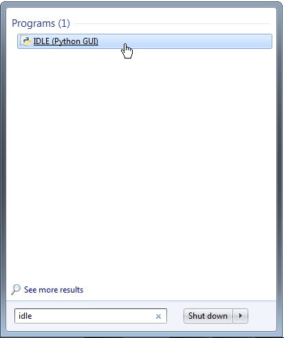

2. Select **File > Open**

3. Find *Prepare_SVG.py* in the dialog window that appears, opening the file up.

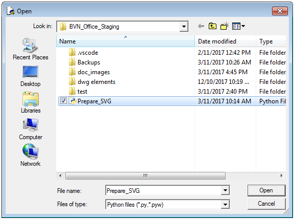

4. The code should present itself.

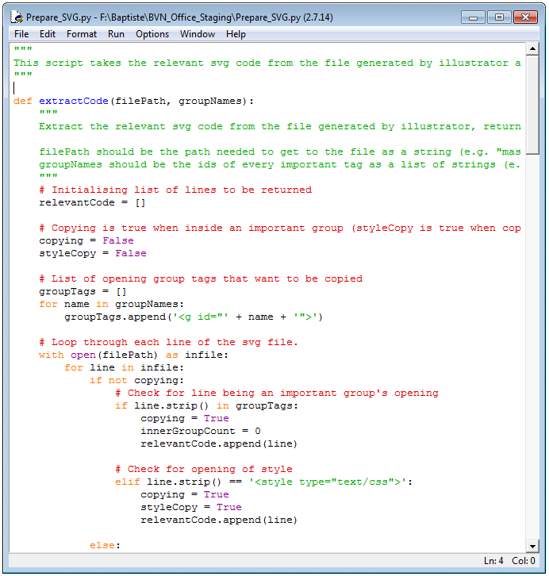

5. Every so often you should see a line that starts on the very right that begins with an orange *"def"*. Scroll down until you see the line that says *"def runSVGPrep():"*.

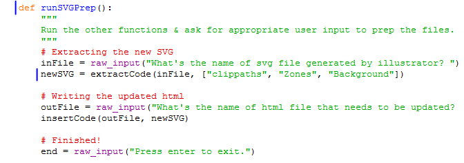

6. Just 6 lines below it, you should see a line that says something like *"newSVG = extractCode(inFile, ["clippaths", "Zones", "Background"])"*. This is the part that we're going to edit, specifically the part that says *"["clippaths", "Zones", "Background"]"*.

7. To add an item to a list in Python (what we're editing is a list), just add a comma after the last item, and put the item in after it. Since the layer that we need to add is a word, we need to put speech marks ("") around it. The line should now look something like this (except with the name of your layer - remember that the case is important! keep it exactly the same as what it's named in illustrator):

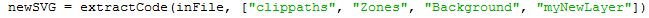

8. Now that we've finished the editing, just **File > Save** it. When you next use the *Prepare_SVG.py* file, the new layer should be included!

### <a name="fileGuide">Important Files</a>

There are various files in the repo, some more critical than others to the website's creation. Here's a list of the ones you may need to know about:

| Name | Description |
|---|---|
|index.html|This is a ***h**yper<b>t</b>ext **m**arkup **l**anguage* file, and is what people are viewing when looking at the visualisation. If you need to edit it and you're a bit unsure of how to do what you want to do, [this website](https://www.w3schools.com/html/default.asp) is a great guide on how html works.|
|style.css|This is a ***c**ascading **s**tyle **s**heets* file, and it controls a lot of how the website looks, rather than the content - think fonts, colour, spacing, arrangement and other rules for the html. This is needed for the html to load correctly.|
|scripts.js|This is a ***j**ava<b>s</b>cript* file. It controls how the visualisation actually works behind the scenes, connecting the spreadsheet data, the slider, and the different images in a way that makes sense. This is needed for the interactivity of the visualisation.|
|MasterFloorplan.ai|This is the illustrator file, and is the first file not needed for the actual website to load. This file is used for all the clipping mask and other layer editing tasks.|
|EmptyFloorplan.png|This image is used as the background of the visualised floorplan.|
|ExistingFloorplan.png|This is the image used for how the office was layed out beforehand.|
|ProposedFloorplan.png|Same as *ExistingFloorplan.png* except for the future layout.|
|MasterFloorplan.svg|This is a ***s**calable **v**ector **g**raphics* file, and is the file you should overwrite when saving for the website. It provides the clipping masks and the block layers.|
|Prepare_SVG.py|This is a ***py**thon* file that takes all the relevant information out of *MasterFloorplan.svg* file and puts it into the *index.html* file. You'll need to install [python 2.7]() in order to use it.|
|README.md|That's this document! Provides a comprehensive guide on how to edit and otherwise use the website for visualisations, and looks a lot better when viewed on github.com or in github for desktop. All the images used in this document are stored in the [doc_images](doc_images) folder.|

### <a name="githubGuide">Important Files</a>

Gotta do this!

 - Backing stuff up
 
 - Web hosting pages stuff

## <a name="SetUp">New Website Setup</a>

Creating a new website for a different floorplan entirely is quite an involved process, especially depending on what source information you have. This guide will assume that you have a timeline of different stages, a render of the floorplan before, and a render of the floorplan afterwards.

*Note: This method isn't limited to just 2 states (in fact, it usually uses 3). You can use as many different states as you want (e.g. beginning, stage 1, stage 2, stage 3, etc., end, ...)*

### Base image creation

1. Inspect all of your stage images (typically just before and after), noting which parts of the images are common between the states. For example, in the following two floorplans (existing and proposed):

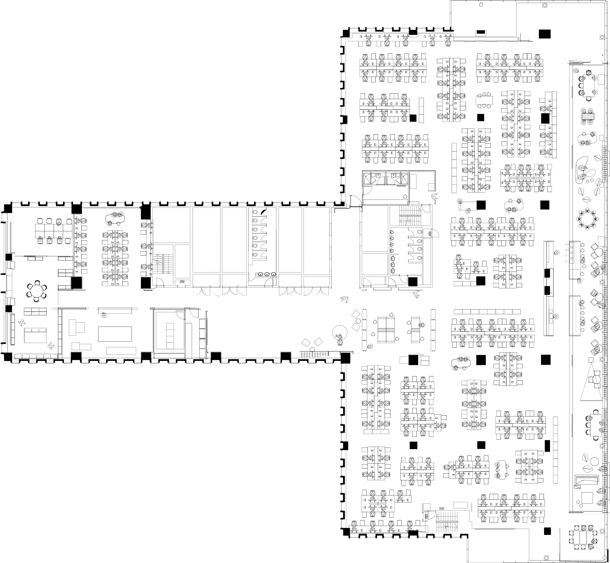

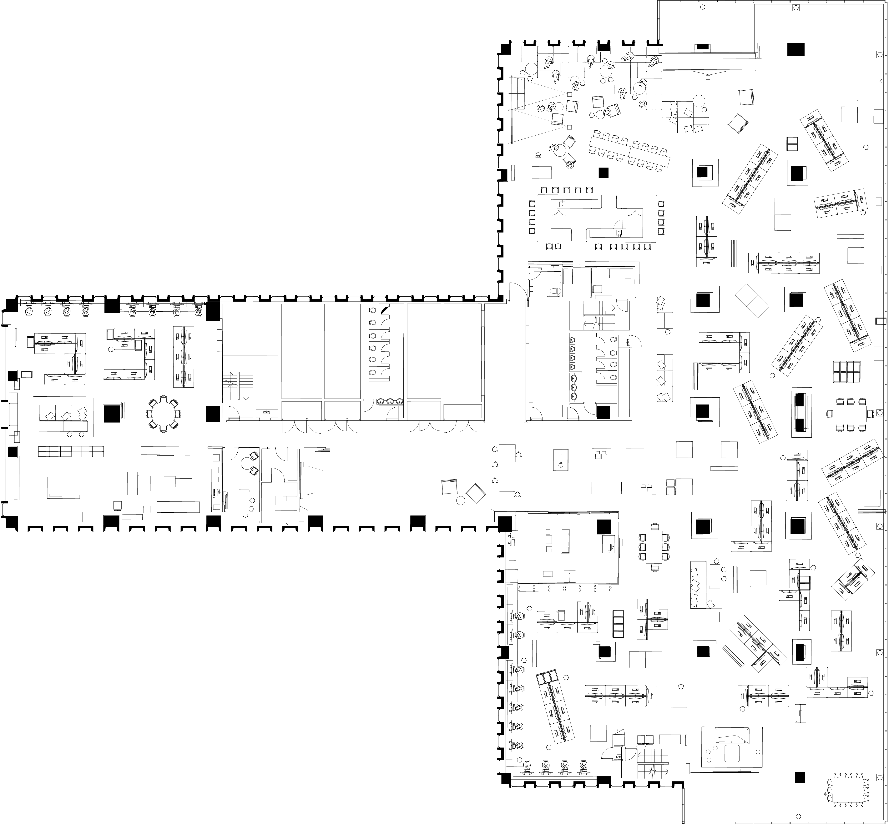

   The following is common to both:

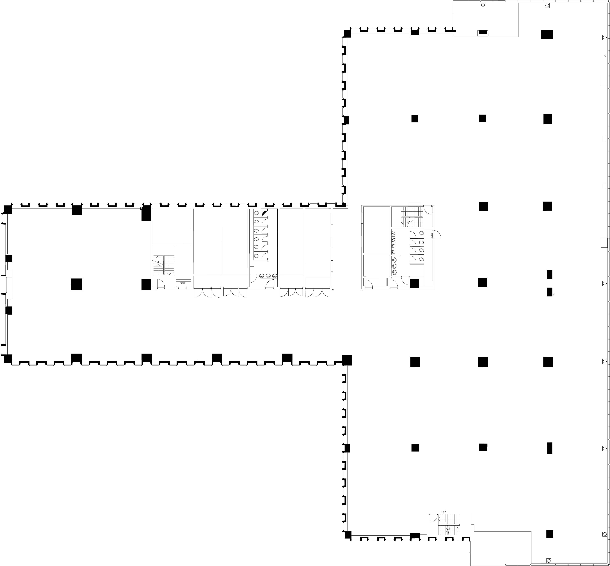

2. Using a copy of one of the original images, photoshop out the part that isn't common to get the background image:

3. Then, photoshop this common section out of the original two images (to be left with only the uncommon parts):

   *Note: Ensure that these are saved as png files with transparent backgrounds for the best results.*

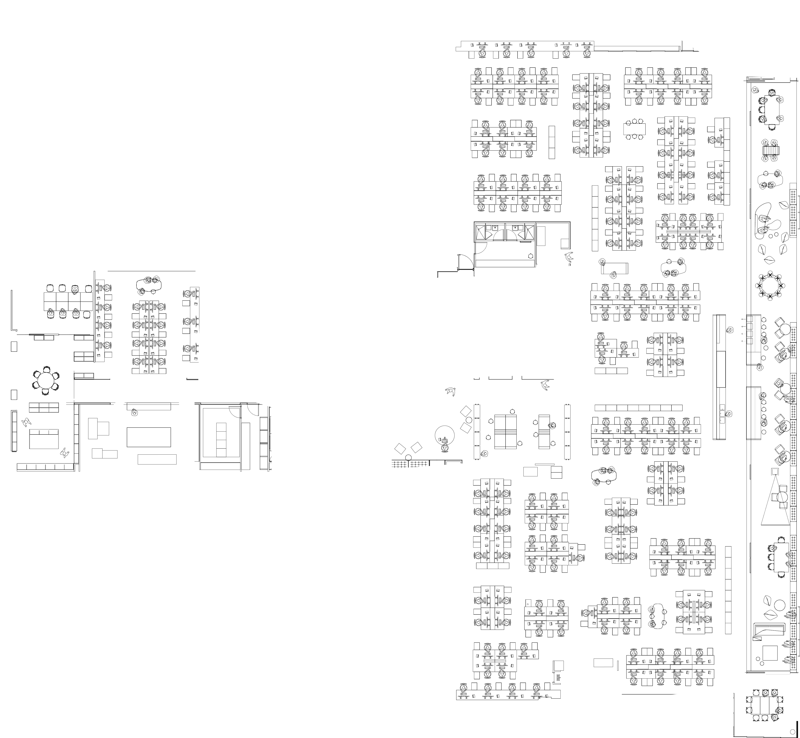

4. You should now have all of your base images.

### Illustrator Setup

1. Open up an illustrator document with appropriate sizing (should fit your images well - this file is the one that's going to be used for creating the SVG files.

2. Import the images using **File > Place**. Their names should be "\<Linked File\>" in the layers panel - do not embed them.

   *Note: Although not necessary, it's a good idea to put them all in a layer called "Source Images" or something similar."*

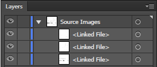

3. Ensure that they're all placed exactly in the right position relative to each other (right on top of each other):

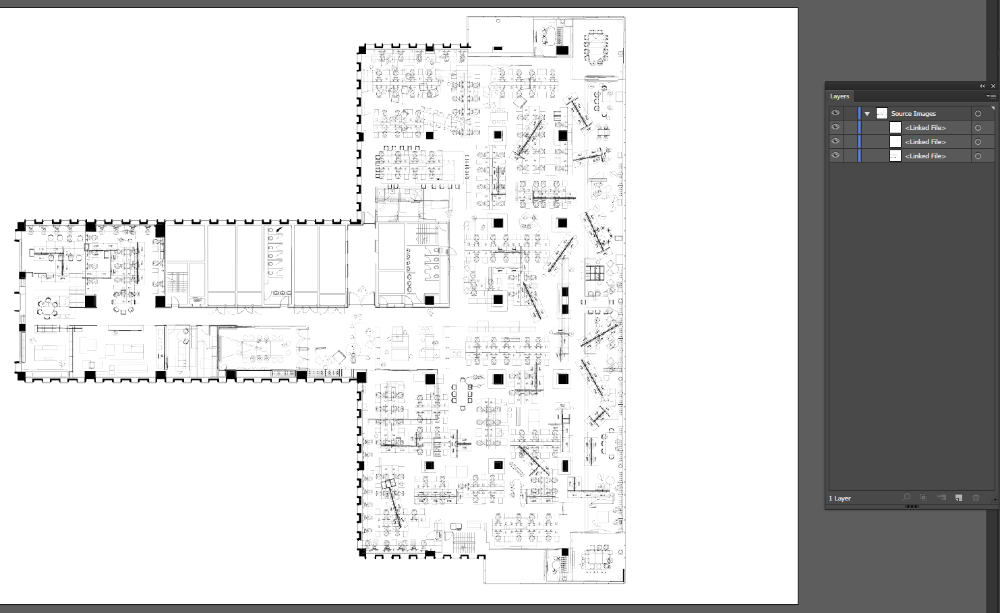

### Defining Sections

This section is largely dependant on what type of information you're sourcing from. In some way, you'll need to split the existing and proposed floorplans into groups of elements that all appear and disappear at the same time. The information that I had while building the original BVN floorplan website was a collection of 22 pdf renders of different stages of the building's works, each having some variation of different groups of elements:

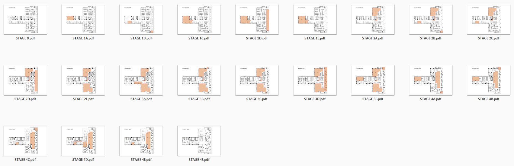

The following steps will assume you have similar information:

1. Select all of the pdf files in file explorer, right clicking and selecting "Combine files in Acrobat..."

   *Note: This is just to make viewing easier while scrolling through the files quickly.*

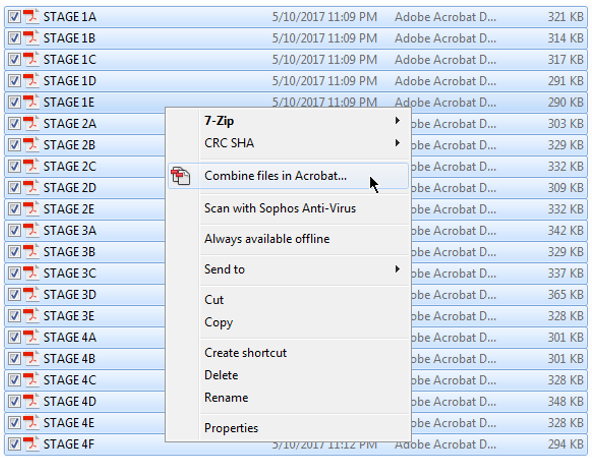

2. At the same time, open up one of these files in photoshop/paint/etc. (I like to use snipping tool) - any image editor that can draw lines.

3. Scroll through the set of images in acrobat, and draw a line between anything that changes and what didn't change every time part of the image changes. For example, in the following two images:

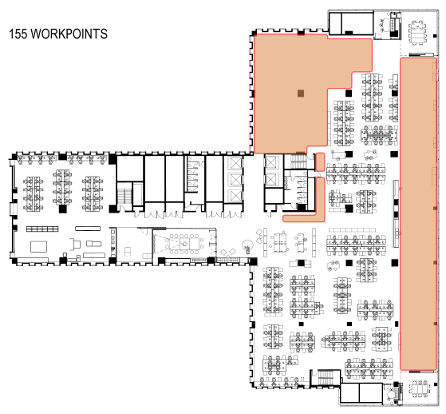

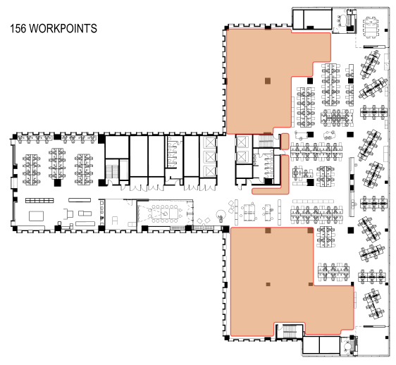

   A line would be drawn here:

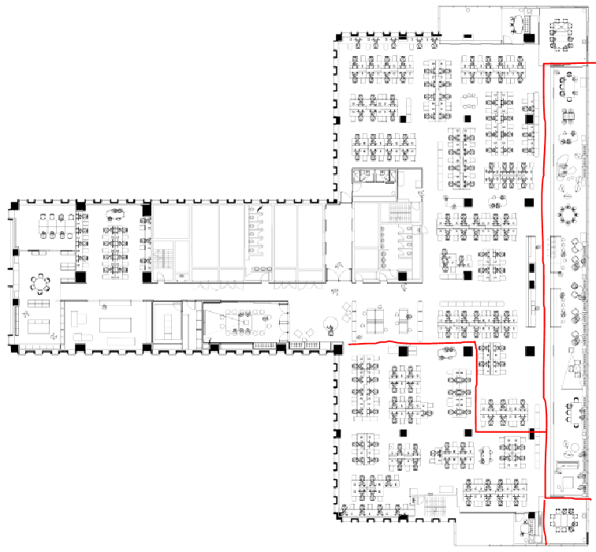

   The end result after looking through all the files should look something like this:

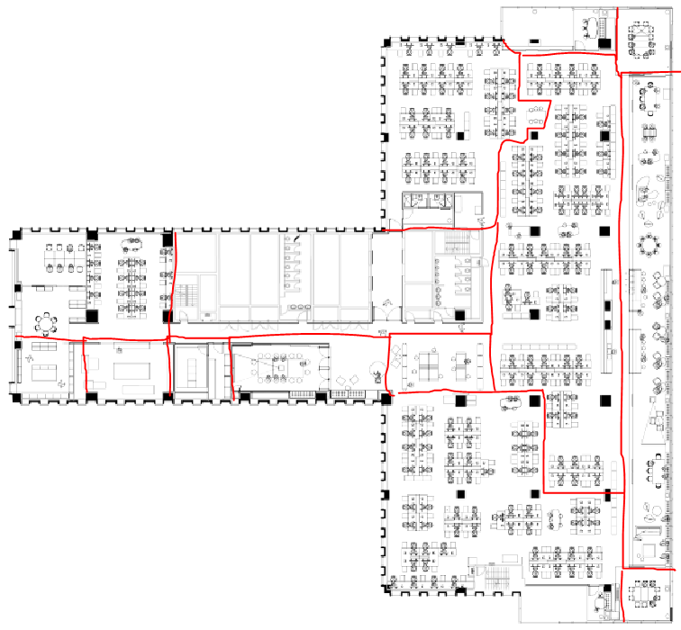

4. This will give you a vague idea of where the different groupings of elements are. Now, we'll have to go through the list of images again and look out specifically for each block to see where its exact barriers are. This becomes difficult as the barriers of the existing elements don't line up with the barriers of the proposed elements. You'll need to look out for both existing and proposed states of each section. For example, in these two paths of the same section:

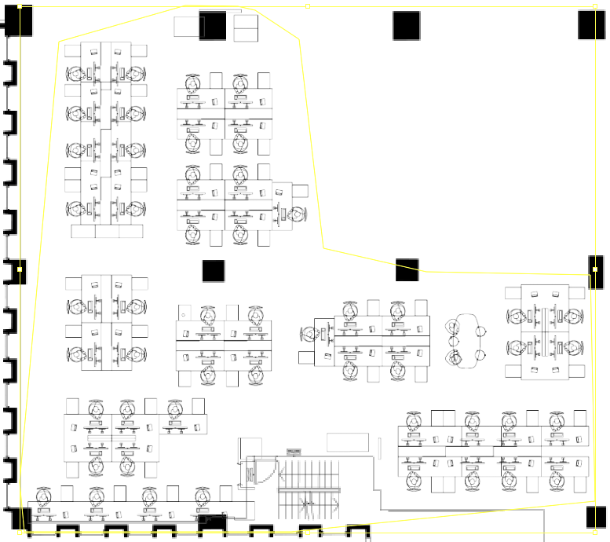

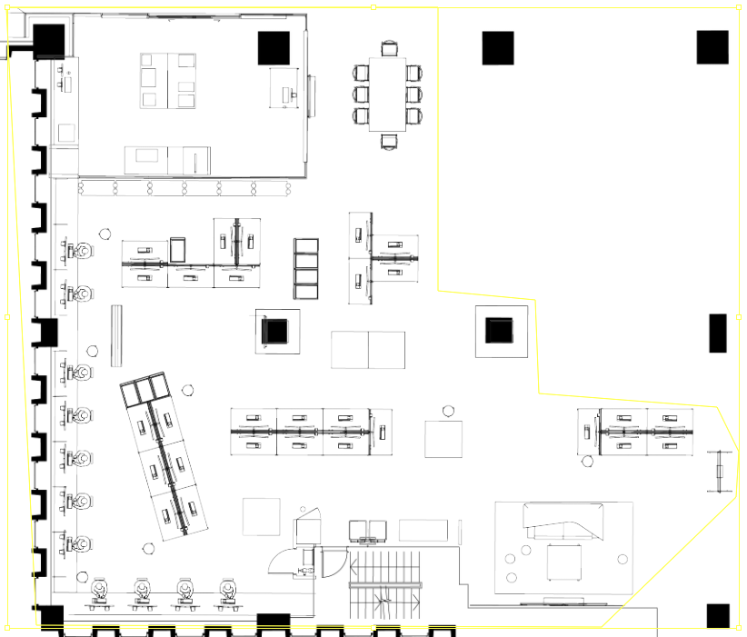

   The proposed and the existing paths are necessarily different while still covering a similar area.
   
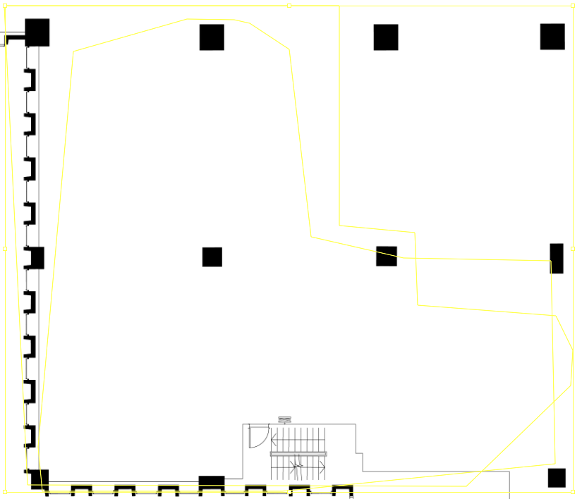

5. After understanding where the barriers are and how the existing and proposed groupings differ, draw polylines around each group in the illustrator document from before (in a new 'paths' layer, ideally with sub-layers for existing and proposed).

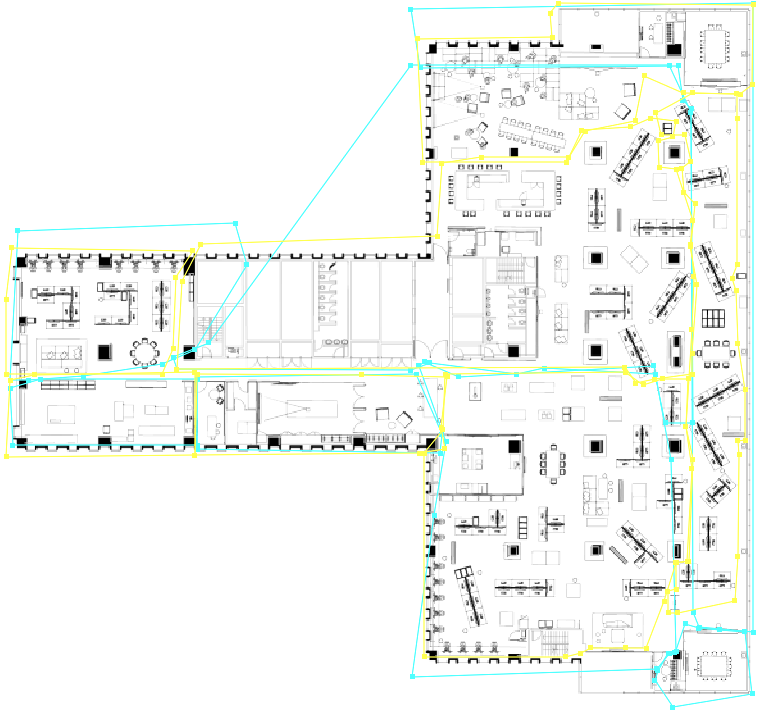

### Creating clipped images

1. Depending on how many different clipping paths you have per state, create that many copies of each image (except the background image as it won't be clipped). Use **Ctrl + Shift + V** to paste in the same place as the original.

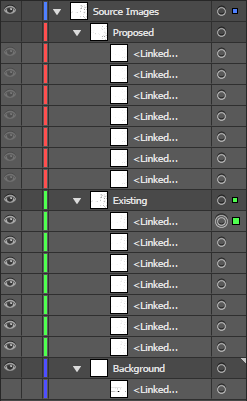

2. Ensure that the paths are above the source images:

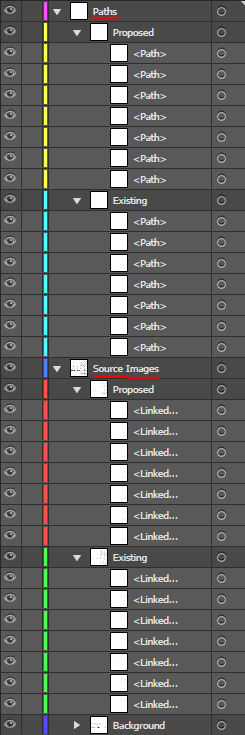

3. To create a clipping mask, first select the source image, then select the appropriate path. Then select **Object > Clipping Mask > Make**, or press **Ctrl + 7** for a shortcut. This will delete both of the original objects, a \<Clip Group\> object appearing in their place.

4. After having repeated this process for all of the path + file combinations, all of your clip groups should be finished. Rename the clip groups appropriately. A good way to name them includes:

     - <a name="layerName">The location (e.g. NorthWing, SouthProjectRoom, etc.)</a>
     
     - The state (e.g. existing or proposed)
     
     - No spaces or symbols, even dashes and underscores (All of these are substituted for obscure character combinations when exporting to SVG)
     
     - No numbers at the beginning of the name (same issue as above) although later in the name is fine.

   e.g. "NorthWingExisting", "NorthWingProposed", "SouthProjectRoomExisting", etc.

5. Move all of the "\<Clip Group\>" files into their own file base layer, called something like *clippaths*. The clipping paths are now done! You should end up with something like this (except with your own names of course!):

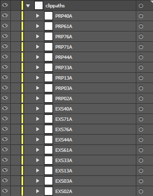

### Creating overlay blocks

1. With the pen tool in illustrator, create all your blocks in their appropriate positions (inside an appropriately named layer, [see here for guidelines](#layerName)).

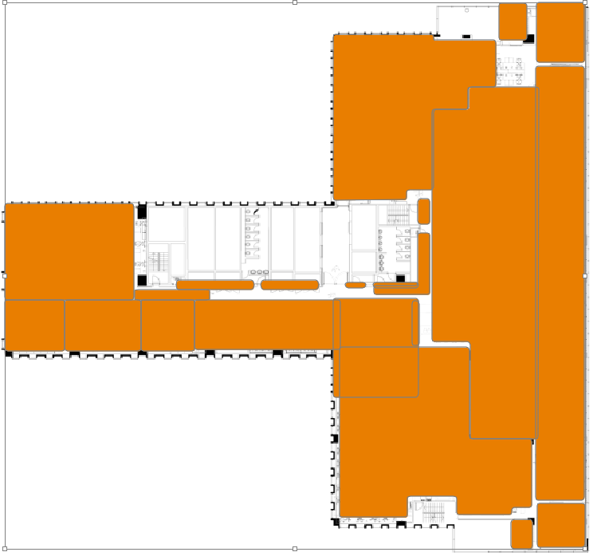

2. In order to make them translucent, select them all and change the opacity down to an appropriate value (I set it to around 50%).

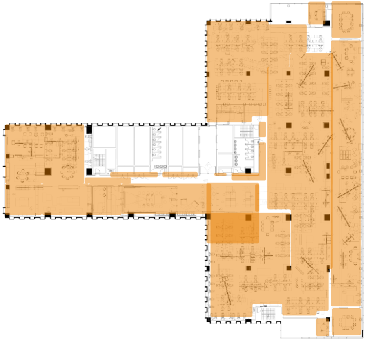

3. Note down which blocks all appear together and disappear together, and then group them in illustrator (Right click and select *group* or press **Ctrl + G**). For example, I grouped these together:

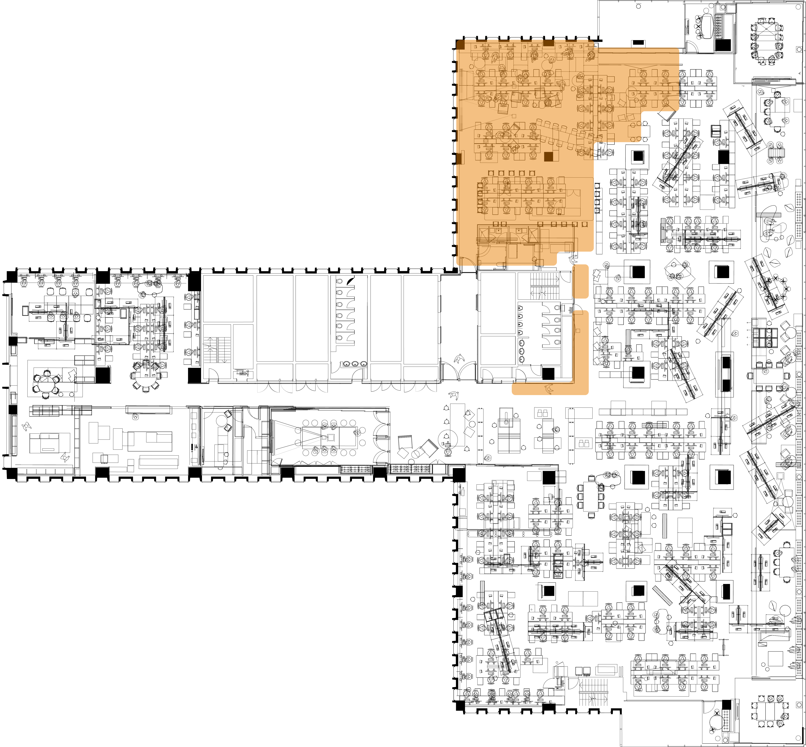

   Now there should be a mix of grouped and non-grouped blocks (if there are only groups, you can skip steps 4-8). Unfortunately, this doesn't work well with the current method of interpreting the svg in the javascript, so we'll need to group each of the individual blocks with a workaround invisible block.

5. With the pen tool, create another small block that's out of the way.

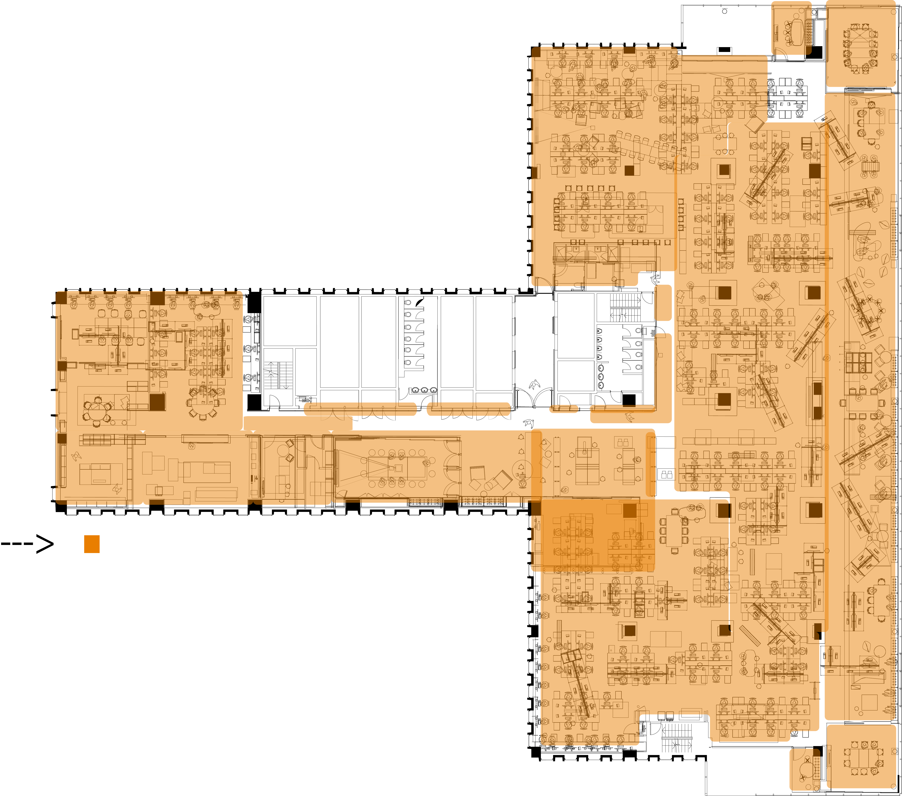

6. Select the block, and make sure that both the border's and the fill's colours are set to 'None'.

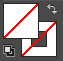

7. Duplicate the block as many times as necessary (one for each actual block not in a group). Use **Ctrl + Shift + V** to paste in the same location.

   *Note: I renamed the blank blocks to BlankBlock from \<path\> for clarity.*
   

8. Group each of the blocks not in groups with one of the blank blocks. You should finally end up with something like this:

GROUP IMAGE HERE

9. CONTINUE FOR RENAMING APPROPRIATELY

### Merging the illustrator files into the 

1. 

### Setting up the times

1. 

